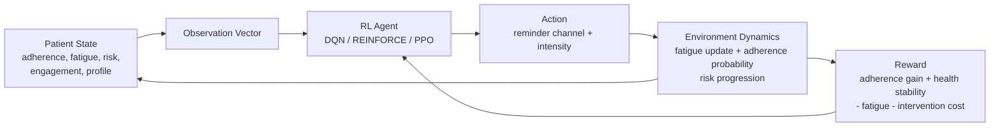

# Agent-in-Environment Diagram

## Description

- The agent receives a compact patient-state observation.
- It chooses one intervention action each day.
- Environment updates adherence, fatigue, and clinical risk with stochastic dynamics.
- Reward encourages long-term adherence and health outcomes while discouraging over-contact fatigue.
